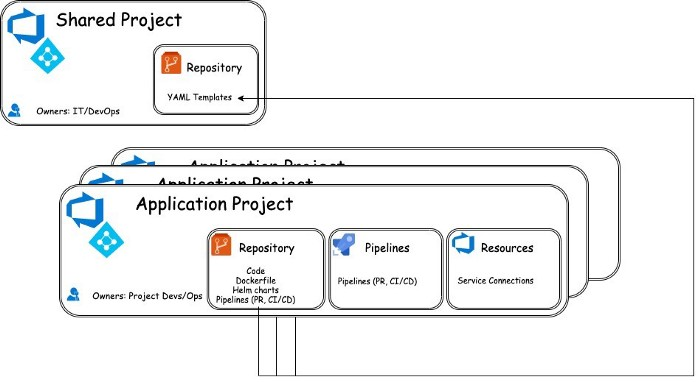
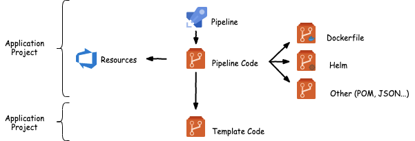
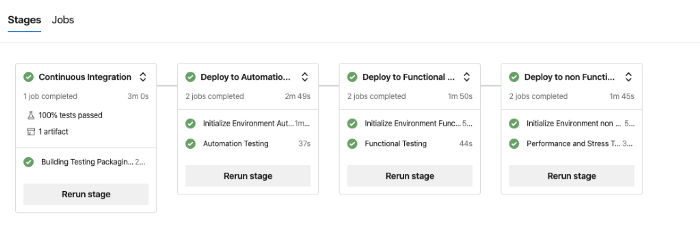

<!-- START doctoc generated TOC please keep comment here to allow auto update -->
<!-- DON'T EDIT THIS SECTION, INSTEAD RE-RUN doctoc TO UPDATE -->
**Table of Contents**  *generated with [DocToc](https://github.com/thlorenz/doctoc)*

- [Sharing Reusable Components](#sharing-reusable-components)
  - [Cenário](#cen%C3%A1rio)
  - [Entendendo o Padrão](#entendendo-o-padr%C3%A3o)
    - [Participantes](#participantes)
    - [Estrutura](#estrutura)
  - [Os templates são blocos de construção](#os-templates-s%C3%A3o-blocos-de-constru%C3%A7%C3%A3o)
  - [Hierarquia de templates](#hierarquia-de-templates)
  - [Padrões de parametrização de modelos](#padr%C3%B5es-de-parametriza%C3%A7%C3%A3o-de-modelos)
    - [Injeção de recursos](#inje%C3%A7%C3%A3o-de-recursos)
    - [Controle de fluxo](#controle-de-fluxo)
  - [Implementando o pipeline](#implementando-o-pipeline)
  - [Referência de modelo do pipeline](#refer%C3%AAncia-de-modelo-do-pipeline)
  - [Diferentes tipos de pipeline](#diferentes-tipos-de-pipeline)
  - [Apoiar o não suportado](#apoiar-o-n%C3%A3o-suportado)
  - [Gerenciamento de liberação de aplicativos](#gerenciamento-de-libera%C3%A7%C3%A3o-de-aplicativos)
  - [Conclusão](#conclus%C3%A3o)

<!-- END doctoc generated TOC please keep comment here to allow auto update -->

# Sharing Reusable Components

Esse artigo apresenta um padrão de design de DevOps com o objetivo de habilitar o compartilhamento de código entre organizações para o setup do
gerenciamento de integração e lançamento, além de discutir os detalhes de implementação do padrão usando o Azure DevOps.

O público-alvo são os `realizadores` técnicos que enfrentam desafios para manter a padronização desses processos em suas organizações. Pode ser uma startup com vários microsserviços desenvolvidos por equipes diferentes, ou pode ser uma grande empresa em que as equipes técnicas pertencem a diferentes unidades de negócios e têm muito pouco em comum em termos de pilha técnica ou mesmo de vida útil do aplicativo - maturidade de gestão.

A organização, por outro lado, preferiria que todos tivessem o mesmo processo de lançamento, passando pelos mesmos portões de qualidade, fases de teste, varreduras de segurança e tal processo. Além disso, essas organizações gostariam de evitar `silos de DevOps` e reduzir ao mínimo os esforços para desenvolver e manter esses processos de automação em toda a organização e compartilhar o trabalho realizado por uma equipe com todas elas.

A adoção recente do setor e o suporte de ferramentas para pipelines como código (GitHub Actions , Azure Pipelines YAML , Jenkins) permitem que as equipes definam seus processos de compilação e lançamento em arquivos de código. O código é mantido, versionado e compartilhado em um modelo git padrão e permite padrões avançados sobre DevOps que permitem o compartilhamento organizacional do processo, seja qual for o aplicativo subjacente.

## Cenário

Os exemplos de código e padrões mencionados neste post são baseados no trabalho realizado em colaboração entre a Finastra e a equipe de Engenharia de Software Comercial da Microsoft, como parte dos esforços da Finastra para modernizar as operações dentro da organização.

A Finastra é a terceira maior fintech do mundo. Seus objetivos são fornecer recursos de open banking a todos os seus clientes, oferecendo APIs abertas em sua plataforma e aumentar sua receita de serviços.

Para atingir esses objetivos, a Finastra começou a construir uma plataforma comum, chamada FFDC ( Fusion Fabric Dot Cloud ), que atende a esse propósito e expõe as APIs necessárias.

Em cima da plataforma, e em conjunto com ela, os serviços da Finastra são implantados de forma CI/CD na nuvem, fornecendo a funcionalidade necessária e atendendo os clientes.

Alguns dos serviços subjacentes estão sendo renovados e modernizados com abordagens modernas, como microsserviços e implantados como contêineres, enquanto outros mantêm sua abordagem clássica e estão sendo implantados como contêineres monolíticos ou até mesmo como serviços regulares dentro de máquinas virtuais.

Na Finastra, eles querem criar um pipeline contínuo que dê suporte a todas as topologias de arquitetura subjacentes — microsserviços e monólitos — e ser capaz de produzir uma abordagem holística para CI/CD para todos os aplicativos.

## Entendendo o Padrão

Pretendemos implementar um pipeline de CI/CD "write-once run-everywhere" que cria, publica e valida qualquer aplicativo, mantendo a propriedade de recursos e o controle de acesso de identidade no nível do projeto, permitindo assim o compartilhamento de processos de ALM (Application Lifecycle Management) em toda a organização.

### Participantes

- Projetos: Os projetos contêm código, recursos e identidades. Existem dois tipos de projetos que são explicados abaixo, um projeto compartilhado (único) e um projeto de aplicação (vários).
- Modelo: Arquivo de código reutilizável. Os templates são mantidos no repositório de projeto compartilhado.
- Código do pipeline: Arquivo de código não reutilizável que contém parâmetros específicos do aplicativo ou do ambiente.
- Instância de pipeline: O formulário importado de um arquivo de código de pipeline na ferramenta DevOps (Azure Pipelines)

### Estrutura

<p align="center">
  
</p>

Um projeto fornece escopo e contexto. É um recipiente de:

- Código: Em um ou mais repositórios.
- Recursos: Quaisquer componentes de ambiente necessários para compilação, integração e teste. Isso pode incluir, por exemplo, endpoints de conexão para diferentes clusters de teste usados ​​em CD ou endpoints autorizados para ferramentas de varredura específicas usadas em CI.
- Pipelines: Automatize processos como validações de pull request ou CI/CD que cria e testa o aplicativo.
- Identidades: Quem possui os recursos do projeto e quais são suas funções e acesso.

**Projeto Compartilhado**

O projeto compartilhado contém principalmente código em arquivos de template. Esse código é de propriedade de uma equipe centralizada de engenheiros de DevOps e mantido como um repositório interno (o uso de metodologias de desenvolvimento semelhantes a código aberto dentro dos limites de uma organização), aceitando alterações das diferentes equipes de desenvolvimento da organização.

Além do código nos templates, este repositório contém os componentes necessários para implementar "DevOps-for-DevOps", conforme explicado mais adiante no post.

**Projeto de Aplicação**

Um projeto de aplicativo pertence e é mantido por uma única equipe de desenvolvimento que cria um produto ou serviço.

O repositório deste projeto contém o código do aplicativo, Dockerfile, gráficos do Helm e outros componentes codificados que são necessários para CI/CD. Além disso, esse repositório contém um ou mais arquivos de código de pipeline. Não há lógica de compilação ou lançamento implementada nesses arquivos de código de pipeline. Em vez disso, eles fazem referência aos templates no repositório compartilhado.

<p align="center">
  
</p>

## Os templates são blocos de construção

São uma maneira de definir a funcionalidade de DevOps reutilizável em arquivos de código, geralmente YAML.

Os parâmetros do template são resolvidos em tempo de execução e são usados ​​para controlar o fluxo dentro do template ou para obter acesso a um recurso.

Eles são:

- Uma funcionalidade atômica que pode operar em qualquer lugar. ou seja, "construa e envie uma imagem docker".
- Uma composição de outros templates e tarefas que representam um processo. ou seja, "CI para aplicativo Node.js que usa o template de imagem do docker de compilação e envio".

```yaml
parameters:
  ...
steps:
  - task: HelmDeploy@0
    displayName: Helm lint
    ...
  - task: HelmDeploy@0
    displayName: Helm Install Plugin Kubeval
    ...
  - task: HelmDeploy@0
    displayName: Helm Run Plugin Kubeval
    ...
  - task: HelmDeploy@0
    displayName: Helm Remove Plugin Kubeval
    ...
```

Implementando uma funcionalidade atômica, `helm lint`, como template em `helm-lint.yml`.

```yaml
steps:
  - task: Kubernetes@1
    displayName: login
    ...
  - template: deploy-helm-native.yml
    parameters:
    ...
```

Assim como uma classe de código de software, os template estão em conformidade com os princípios SRP/DRY (Single Responsibility and Do Not Repeat Yourself) e evitam "efeitos colaterais ambientais" usando apenas parâmetros de template e não variáveis ​​de estado ou compilação do agente.

## Hierarquia de templates

Os modelos são construídos em outros modelos em uma hierarquia composta para descrever processos fora das unidades atômicas de funcionalidade.

Na pasta raiz do repositório do projeto compartilhado há um modelo principal , que é uma composição de todos os modelos do repositório. O modelo principal implementa um processo completo de CI/CD, pelo qual todos os aplicativos da organização passam ao criar e entregar uma nova versão.

O processo entrega o aplicativo a vários ambientes de teste, implementando um conjunto diferente de testes funcionais ou não funcionais no aplicativo entregue antes de movê-lo para o próximo.

## Padrões de parametrização de modelos

Os parâmetros dos templates são, de certa forma, a API do template. O criador do modelo permite que os usuários do modelo forneçam diferentes argumentos de tempo de execução que controlam a maneira como ele funciona.

A seção de parâmetros do modelo raiz é uma lista de objetos de parâmetro semelhantes a JSON, nomeados após cada estágio do pipeline. Isso torna mais fácil entender o propósito de cada parâmetro.

```yaml
PR: {
  enabled: '',
  gate: '',
  credscan: '',
  codescan: '',
  vulnerabilitiesscan: ''
}
CI: {
  enabled: '',
  azureSubscription: '',
  azureContainerRegistry: '',
  scan: '',
  gate: ''
}
AUTOMATION: {
  ...
}
FUNCTIONAL: {
  ...
}
...
```

Cada estágio do pipeline pode ser habilitado ou desabilitado usando a propriedade booleana "enabled", permitindo que diferentes instâncias de pipeline sejam criadas a partir do template. Por exemplo, ao implementar um pipeline PR, apenas o estágio PR é habilitado e os outros são desabilitados.

### Injeção de recursos

O uso de parâmetros de modelo para injetar recursos de ambiente permite que o código no repositório compartilhado seja agnóstico no ambiente e assuma o acesso a ele.

Os modelos usam parâmetros para definir quais conexões de serviço são necessárias para operar, e os pipelines de referência devem fornecer essas conexões em tempo de execução.

```yaml
parameters:
  azureContainerRegistry: ''
  ...
steps:
  - task: Docker@2
    displayName: Login to ACR
    inputs:
      command: login
      containerRegistry: ${{parameters.azureContainerRegistry}}
```

### Controle de fluxo

Normalmente, cada estágio pode ser executado de mais de uma maneira, dependendo do aplicativo entregue.

Por exemplo, definir o parâmetro de tipo de compilação para CI-stage como `Node.js/Java/Go` faz com que o estágio execute um modelo de compilação diferente que se ajuste à linguagem.

```yaml
passos:
  - ${{ if eq(parameters.buildType, 'java') }}:
    - template: java/build-maven.yml
    ...
  - ${{ if eq(parameters.buildType, 'nodejs') }}:
    - template: nodejs/build-npm.yml
    ...
  - ${{ if eq(parameters.buildType, 'golang') }}:
    - template: golang/build-go.yml
    ...
```

Da mesma forma, usar a propriedade deploy-type seleciona o tipo de deployment usado durante o CD:

```yml
parâmetros:
  deployType: ''
  passos:
    - ${{ if eq(parameters.deployType, 'helm-native') }}:
      - template: deploy-helm-native.yml
      ...
    - ${{ if eq(parameters.deployType, 'helm-weblogic') }}:
      - template: deploy-weblogic.yml
      ...
    - ${{ if eq(parameters.deployType, 'gitops') }}:
      - template: deploy-gitops.yml
      ...
    - ${{ if eq(parameters.deployType, 'fabrikate') }}:
      - template: deploy-fabrikate.yml
      ...
```

No nível do template, cada estágio, "CI" e "Test", é dividido em uma sequência de subelementos como "build", "test", "package", cada elemento é um template com um parâmetro que pode ter valores diferentes.

No nível do pipeline, quando os parâmetros são definidos para modelos, eles definem o valor do parâmetro, colorindo o subelemento de acordo, indicando a instância de tempo de execução do modelo quando parametrizado com esse valor.

<p align="center">
  
</p>

Esses tipos de parâmetros controlam o fluxo em um modelo. Eles são avaliados dentro do modelo, usando a propriedade de condição em uma tarefa ou trabalho, ou usando inserções condicionais.

```yml
- bash: |
    echo docker scan using 3rd party tool
  displayName: Docker Scan 3rd Party
  condition: eq(${{parameters.scan}}, 'true')
```

or

```yml
- job: Tests
  displayName: 'Functional Testing'
    steps:
      - ${{ if eq(parameters.Functional.testType, 'gatling') }}:
        - template: Templates/Test/gatling-functional-tests.yml
        ...
      - ${{ if eq(parameters.Functional.testType, 'postman') }}:
        - template: Templates/Test/postman-functional-tests.yml
        ...
```

Observe que:

- Uma referência a um modelo não possui uma propriedade de condição. Isso significa que os modelos compostos que chamam outros modelos precisam usar a inserção condicional para controlar o fluxo entre seus submodelos, conforme visto no código de exemplo acima.
- Se uma tarefa exigir uma conexão de serviço:
  - Ignorar a tarefa usando a propriedade condition requer uma conexão de serviço válida como entrada.
  - Ignorar a tarefa usando a inserção condicional não requer uma conexão de serviço válida como entrada.

## Implementando o pipeline

Os projetos de aplicativos são de propriedade e mantidos por equipes de desenvolvimento. Eles contêm código de aplicativo ou serviço e o código para pipelines que criam, testam e entregam seu aplicativo.

Além disso, um projeto contém as autoridades de conectividade e acesso (implementadas como conexões de serviço no Azure DevOps) para vários componentes de infraestrutura ou software usados ​​durante o processo.

## Referência de modelo do pipeline

Os pipelines, que são escritos em YAML no repositório do projeto do aplicativo, fazem referência direta ao modelo do repositório compartilhado. Ao trabalhar com o Azure Pipelines, isso pode ser feito usando a referência de yaml, que funciona para GitHub ou Azure Repos.

## Diferentes tipos de pipeline

Os pipelines são códigos DevOps específicos do projeto que são construídos sobre os modelos. Todos os pipelines, em todos os projetos, usam o mesmo template e fornecem entradas para a API do template por meio de parâmetros, para controlar como e em qual ambiente ele opera.

Um pipeline pode ser importado para a ferramenta e executado como um fluxo de trabalho automático.

Em um projeto de fluxo de trabalho típico do GitHub, uma equipe mantém um pipeline de validação de solicitação pull que é acionado quando os PRs são criados e um pipeline de CI/CD que é acionado quando uma confirmação é mesclada com a ramificação mestre.

## Apoiar o não suportado

O padrão não pretende dar suporte a todos os casos extremos que podem surgir de equipes, usando código pronto para uso, do repositório compartilhado. O design do modelo fornece maneiras de substituir o comportamento interno e injetar etapas externas usando inserções de tarefas em todos os modelos.

Em última análise, porém, o objetivo da organização e das equipes dentro dela é estar em conformidade com os métodos padrão. Se, em algum ponto do ciclo de vida do modelo, várias equipes exigirem a mesma lógica injetada no pipeline para operar, ela será gerada como um PR para a ramificação principal, onde o código é compartilhável.

## Gerenciamento de liberação de aplicativos

Com Environments , o Azure Pipelines permite um melhor gerenciamento de versão fornecendo visibilidade para ambientes de destino e uma maneira de acessar os ambientes de destino por uma implantação. Os destinos com suporte incluem Kubernetes, Serviço de Aplicativo, Máquinas Virtuais e muito mais.

<p align="center">
  
</p>

Os ambientes são uma coleção de conexões de serviço do Azure DevOps para namespaces do Kubernetes (no nosso caso) que são implementados como uma conta de serviço em namespaces específicos no cluster.

Ao usar trabalhos de implantação em nosso modelo, podemos usar facilmente a conexão de serviço oferecida pelo recurso de ambiente em nosso pipeline.

```yml
- stage: Automation
  displayName: 'Deploy to Automation environment'
  jobs:
    - deployment: Init
      displayName: Initialize Environment Automation
      environment: ${{parameters.AUTOMATION.environmentNamespace}}
      strategy:
        runOnce:
          deploy:
            steps:
              - template: Templates/Deploy/deploy-to-environment.yml
```

## Conclusão

Esta postagem descreveu o padrão de design "Compartilhamento de Componente DevOps Reutilizável", que pode ser usado para maximizar o efeito de grupos de DevOps em uma organização e explorou sua implementação usando métodos baseados em código no Azure DevOps.

O exemplo de código fornecido é um bom lugar para você começar a construir esses processos com suas equipes, usando qualquer ferramenta, desde que suporte os elementos do padrão. No entanto, observe que os pipelines existentes de sua equipe também são candidatos válidos para iniciar o processo e refatorar o código para ser mais generalizado.

No envolvimento colaborativo e "código com" do cliente, as equipes de engenharia de software comercial da Finastra e da Microsoft trabalharam juntas na refatoração de pipelines e scripts existentes com esse modelo e criaram com sucesso uma base codificada de componentes DevOps que hoje aceleram novas equipes para fluxos de trabalho contínuos dentro da Finastra.
